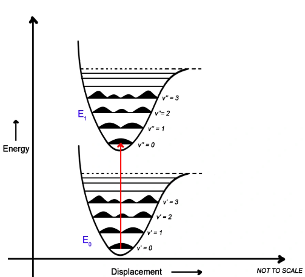
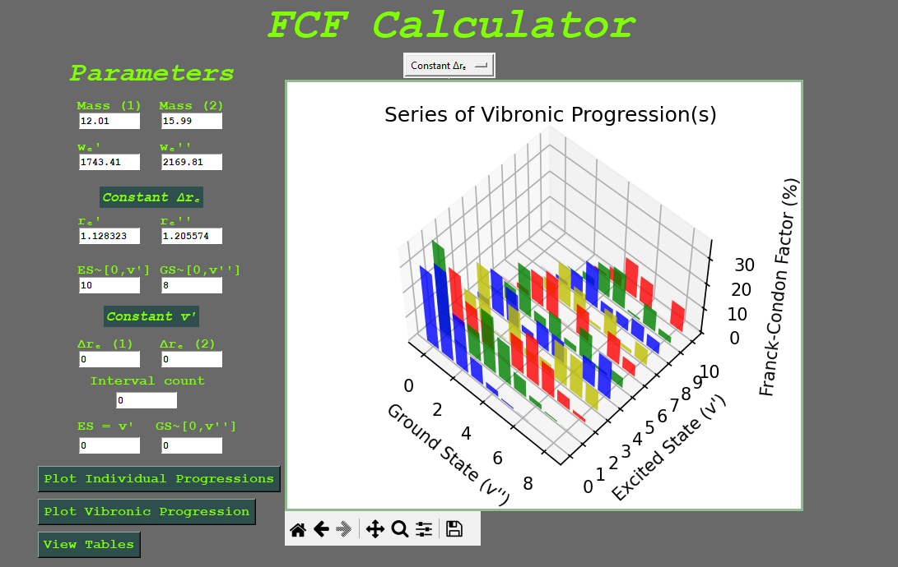
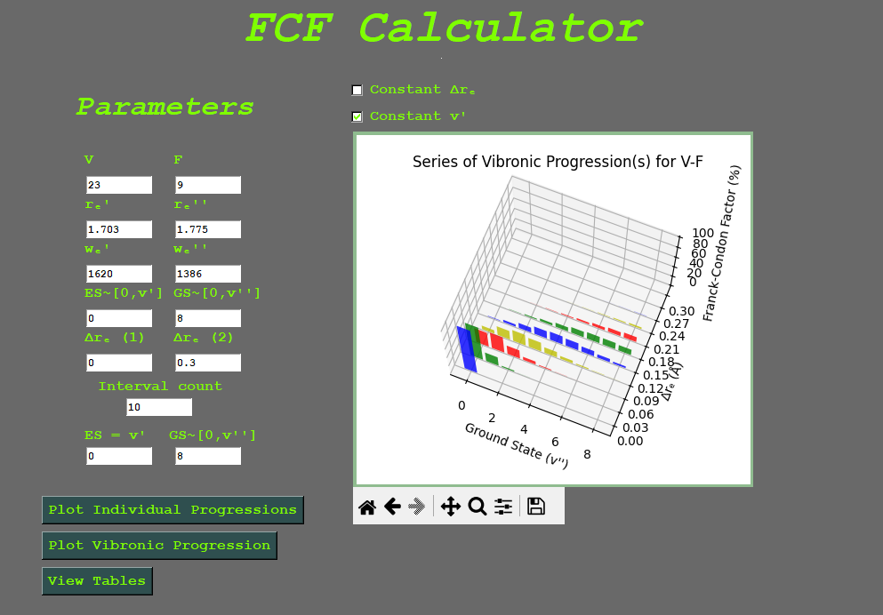
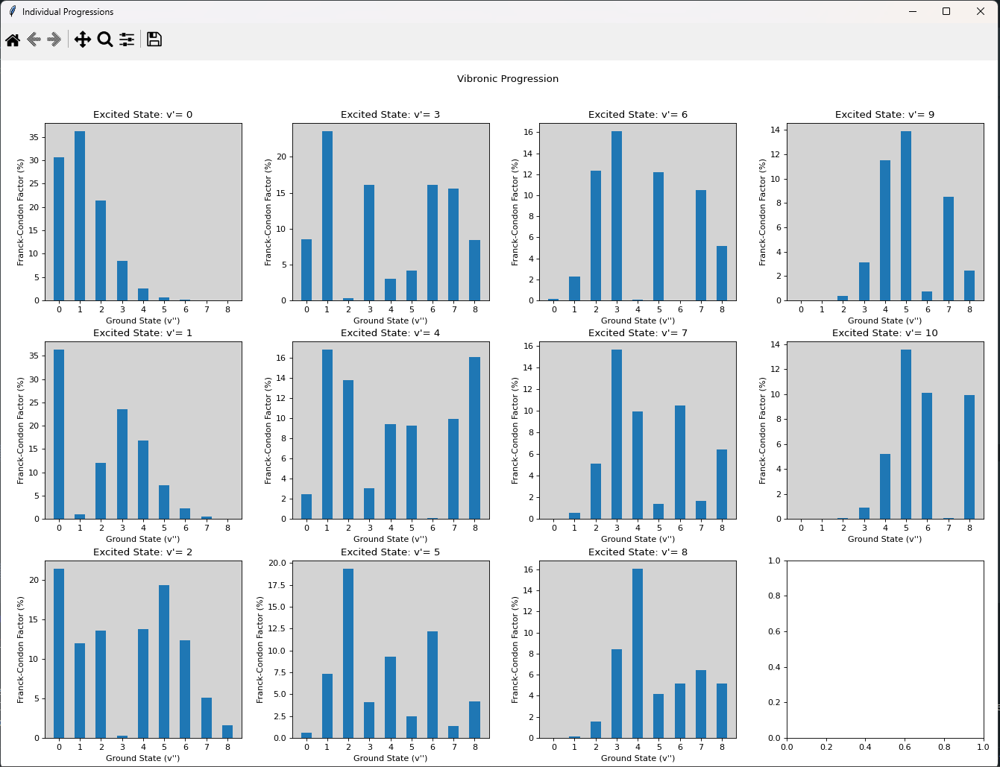

# FCF-Calc
*Franck-Condon Factor Calculator for Diatomics (Electronic Spectroscopy)*

Author: James Bradley

FCF-Calc serves to visualize vibronic (vibrational-electronic) progressions for spectroscopy research in the [Varberg Lab](https://www.varberglab.com/).
------------------------------------------------------------------------------------------------------------------------------
# Inspiration and Theory

This application draws heavily from a paper by R. W. Nicholls (DOI: 10.1063/1.443949). This paper provides an approximation for the overlap integral between wavefunctions in the ground/excited states of a diatomic molecule. The intensity of transitions in electronic spectroscopy (which appear in spectra) is proportional to the electric dipole moment of the molecule between wavefunctions in the ground/excited states. 

To provide some background for the mathematical formalisms of Quantum Mechanics, the document `QM-Review.pdf` has been added to this repository.

With the Born-Oppenheimer approximation, we can assume that the velocity of the nucleus is negligible compared to that of the electron due to the difference in their masses, $m_e << m_n \implies v_e >> v_n$. 

A consequence of this approach is that the equilibrium bond length of the molecule in the ground ($r''_e$) and excited state ($r'_e$) do not change during transitions. Thus, we can represent electronic transitions as vertical arrows between (anharmonic) vibrational potential energy curves. We visualize these transitions with Jablonski diagrams. 



As mentioned before, the intensity of a transition is proportional to the squared expectation value of the dipole moment:

$$I \propto \braket{\mu}^2$$

Let $\psi_{gs}$ be the ground state wavefunction and $\psi_{es}$ correspond to the wavefunction of the excited state. We can represent $\braket{\mu}$ in bra-ket notation:

$$\braket{\mu} = \braket{\psi_{es} | \hat{\mu} | \psi_{gs}}.$$

We must consider each wavefunction as a product of two wavefunctions (with respect to the coordinates of the electron and nucleus). The dipole moment operator, $\hat{\mu}$, can also be decomposed similarly, except it is a sum:

- $\psi_{gs} = \psi_{gs, e}$ $\psi_{gs, n}$
- $\psi_{es} = \psi_{es, e}$ $\psi_{es, n}$
- $\hat{\mu} = \hat{\mu}_e + \hat{\mu}_n.$

Note: What is an electric dipole?

The energy of a transition can be described as $E = \mu \cdot \epsilon$, $\epsilon$ is the electric field with units N/c. This means that:

$$[E] = Nm \implies [\mu] \cdot N/c = Nm \implies [\mu] \cdot \frac{cNm}{N} = c\cdot m.$$

The electric dipole is the product of the charge of a particle and its position.

Thus, we can rewrite $\braket{\psi_{es} | \hat{\mu} | \psi_{gs}}$ as:

$$\braket{\psi_{es} | \hat{\mu} | \psi_{gs}} = \braket{\psi_{es, e} \psi_{es, n}| \hat{\mu_e} + \hat{\mu_n} | \psi_{gs, e} \psi_{gs, n} } = \braket{\psi_{es, e} \psi_{es, n}| \hat{\mu_e} | \psi_{gs, e} \psi_{gs, n} } + \braket{\psi_{es, e} \psi_{es, n}| \hat{\mu_n} | \psi_{gs, e} \psi_{gs, n} }.$$

The dipole moment operators corresponding to the electron and nucleus only act on wavefunctions associated with the correct sub-atomic coordinates (electron or nucleus). We can rearrange the previous expression to reflect this fact:

$$\implies \braket{\psi_{es, e} \psi_{es, n}| \hat{\mu_e} | \psi_{gs, e} \psi_{gs, n} } + \braket{\psi_{es, e} \psi_{es, n}| \hat{\mu_n} | \psi_{gs, e} \psi_{gs, n} } = \braket{\psi_{es, n}|\psi_{gs, n}}\braket{\psi_{es, e} | \hat{\mu_e} | \psi_{gs, e}} + \braket{\psi_{es, e}|\psi_{gs, e}}\braket{\psi_{es, n} | \hat{\mu_n} | \psi_{gs, n}}.$$

Since wavefunctions to the Schrodinger equation are orthogonal to each other if they are not degenerate (they do not have the same eigenvalue for the Hamiltonian operator), $\braket{\psi_{es, e}|\psi_{gs, e}} = 0$, and the nuclear component of the electric dipole moment vanishes,

$$\implies \braket{\psi_{es, n}|\psi_{gs, n}}\braket{\psi_{es, e} | \hat{\mu_e} | \psi_{gs, e}} + \braket{\psi_{es, e}|\psi_{gs, e}}\braket{\psi_{es, n} | \hat{\mu_n} | \psi_{gs, n}} = \braket{\psi_{es, n}|\psi_{gs, n}}\braket{\psi_{es, e} | \hat{\mu_e} | \psi_{gs, e}}.$$

Let $S_{v',v''}^2 = |\braket{\psi_{es, n}|\psi_{gs, n}}|^2$, this is the Franck-Condon Factor (FCF). It represents how much the given wavefunctions in the ground and excited state overlap.

$$\braket{\mu} = S_{v',v''}\braket{\psi_{es, e} | \hat{\mu_e} | \psi_{gs, e}} \implies  \braket{\mu}^2 = S_{v',v''}^2\braket{\psi_{es, e} | \hat{\mu_e} | \psi_{gs, e}}^2 $$

With Nicholls' work (which is probably not very accurate but it is simple to use), we have an approximation for the FCF as a function of the vibrational quantum numbers in the excited ($v'$) and ground ($v''$) states:

$$q(v',v'') = S_{v',v''} = |\braket{\psi_{es, n}|\psi_{gs, n}}|^2 = \frac{u^{v''-v'} e^{-u}}{v'! v''!}[L^{v''-v'}_{v'}(u)]^2,$$


where...
- $u = \frac{\mu \bar{w}_e (\Delta r_e)^2}{67.4425}$
- $\bar{w}_e = (2\frac{\sqrt{w_e' w_e''}}{\sqrt{w_e'} + \sqrt{w_e''}})^2$
- $\mu = \frac{m_A m_B}{m_A + m_B}$ (for some molecule AB)
- $\Delta r_e = r_e' - r_e''$
- $L^{k}_{n}(x)$ is the Associated Laguerre Polynomial.

This means that the user needs to specify the following constants:
- $m_A$, $m_B$
- $r_e'$, $r_e''$
- $w_e'$, $w_e''$
- and lastly $v'$, $v''$.

----------------------------------------------
# App Details
Packages needed:
- `matplotlib`
- `scipy`
- `numpy`
- `tk`
- `periodictable`

Install these packages using this line in the terminal:

```
pip install module_name_here
```

Open the app by running the code in `fcf.py`. Note that I have been developing the GUI on Windows so it will look different on Mac OS (probably worse).

**Current functionality:**

**1. Plot a 2D bar chart with different vibronic progressions:**
  - Each bar chart in the series corresponds to the Franck-Condon factor between a fixed excited vibrational state ($v'$) and a specified number of ground states ($v''$).
  - Constants that help describe the vibrational potential energy well of the ground and excited states can be specified:
    - The mass of each atom in the molecule.
    - The vibrational wavenumber of the molecule in the excited ($w_e'$) and ground ($w_e''$) states.
    - The internuclear distance/bond length of the molecule in the excited ($r_e'$) and ground ($r_e''$) states.
    - Lastly, you can choose the number of vibrational states you wish to plot in the excited ($v'$) and ground ($v''$) states. Each bar plot shows the FCF between a constant excited state and various ground states depending on the values entered.
      


**2. Plot a 2D bar chart with various values of $\Delta r_e$ given a fixed excited state ($v'$) and number of ground state levels $[0,v'']$.**



**3. See each individual FCF plot corresponding to a given excited state in another window (dynamic window sizing has not yet been implemented for large values of $v'$ and $v''$).**



**4. Images of the plots can be manipulated and saved as a .png file (pictures are named `image.png` by default) thanks to the matplotlib navbar.**


**What's next on the agenda?**
- Fixing GUI quirks.
- Allowing users to make a 2D chart with an excited state held constant (for all bar plots in the chart) while $\Delta r_e$ varies.
- Allowing users to view data tables associated with the plots.
- More soon!

Last updated: 6/20/2024.
